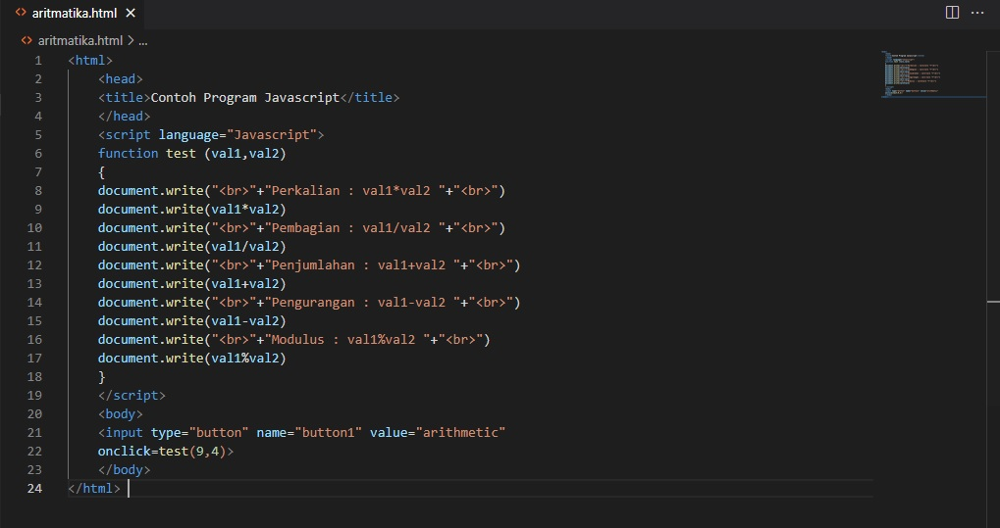
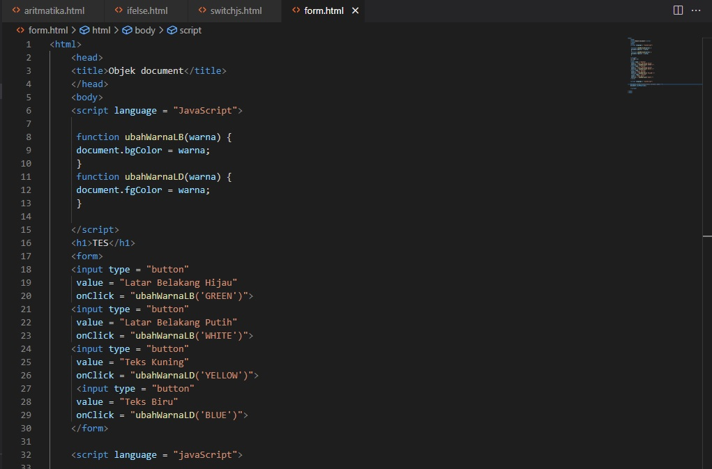

# Lab5Web

###### Nama : Veronika Desna Fau
###### NIM : 312010333
###### Kelas : TI.A.2

## Tugas Javascript WebProgramming

Instruksi Praktikum
1. Persiapkan text editor misalnya VSCode.
2. Buat folder baru dengan nama lab5_javascript.
3. Ikuti langkah-langkah praktikum yang akan dijelaskan berikutnya.
4. Lakukan validasi dokumen html dengan mengakses http://validator.w3.org

## Langkah-langkah Praktikum
Persiapan membuat dokumen HTML dengan nama file lab5_javascript.html seperti berikut

hasil 

## Javascrip Dasar
## Pemakaian Alert sebagai property window

hasil

## Pemakaian method dalam objek

hasil

## Pemakaian Prompt

hasil 

## Pembuatan fungsi dan cara pemanggilannya

hasil 

## Dasar Pemrograman Di Javascript

## Operasi dasar aritmatika

hasil 

## Seleksi kondisi (if..else)

hasil 

## Penggunaan operator switch untuk seleksi kondisi

 
 hasil

## Pembuatan Form
###### Form Input

###### Form Button

## HTML DOM
Pilihan menggunakan checkBox dengan perhitungan otomatis

## Pertanyaan dan Tugas
1. Buat script untuk melakukan validasi pada isian form.

## Laporan Praktikum
1. Buatlah repository baru dengan nama Lab5Web.
2. Kerjakan semua latihan yang diberikan sesuai urutannya.
3. Screenshot setiap perubahannya.
4. Buatlah file README.md dan tuliskan penjelasan dari setiap langkah praktikum beserta 
screenshotnya.
5. Commit hasilnya pada repository masing-masing.
6. Kirim URL repository pada e-learning ecampus

